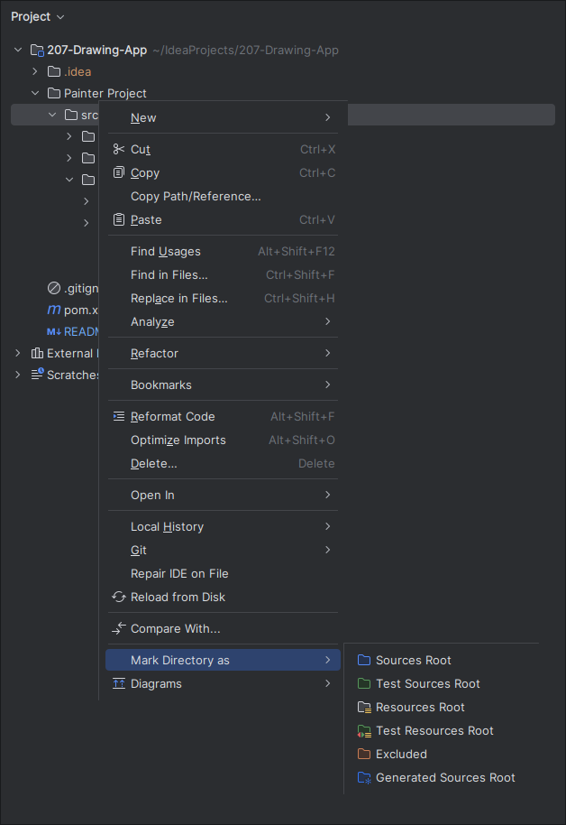

## Setup

1. Clone the Repository

```bash
git clone https://github.com/sage35deng/207-Drawing-App
```

2. Open `207-Drawing-App` with IntelliJ Idea.

3. Right click the `Painter Project/src` directory and mark it as "Sources Root"



4. Open `Painter Project/src/app/Main.java` and press the `Run` button in the top right. (Ctrl + F5)


## Usage 

Currently, our software employs the use of keybindings to switch between tools.

Available tools:
- Brush Tool - Q
  - This tool allows you to draw across the canvas using your selected brush colour.
  - Usage:
    - Hold down the left mouse button and drag your cursor around the canvas.
- Eraser Tool - W
  - This tool allows you to erase drawn items on the canvas.
  - Usage:
    - Hold down the left mouse button and drag your cursor around the canvas.
- Export to PNG - S
  - This tool will export the current canvas image to a PNG file.
  - Usage:
    - Navigate to a folder in which to store the canvas along with your desired filename. 
- Latex OCR - T
  - This tool will scan the canvas for Math and return it back in [LaTeX](https://en.wikipedia.org/wiki/LaTeX) format.
  - Usage:
    - Wait for the OCR to complete, and then check the clipboard when the Latex window pops up.
- Fill Tool - F
  - This tool will fill the current region of the canvas using the [flood fill](https://en.wikipedia.org/wiki/Flood_fill) algorithm.
  - Usage:
    - First, draw a bounded shape, hover your mouse cursor over the area you want to fill, and then invoke the tool.
- Color Tool - C
  - This tool allows you to change the colour of your brush.
  - Usage:
    - Left click on a colour from the new pop up window and your brushes will be set to it.

